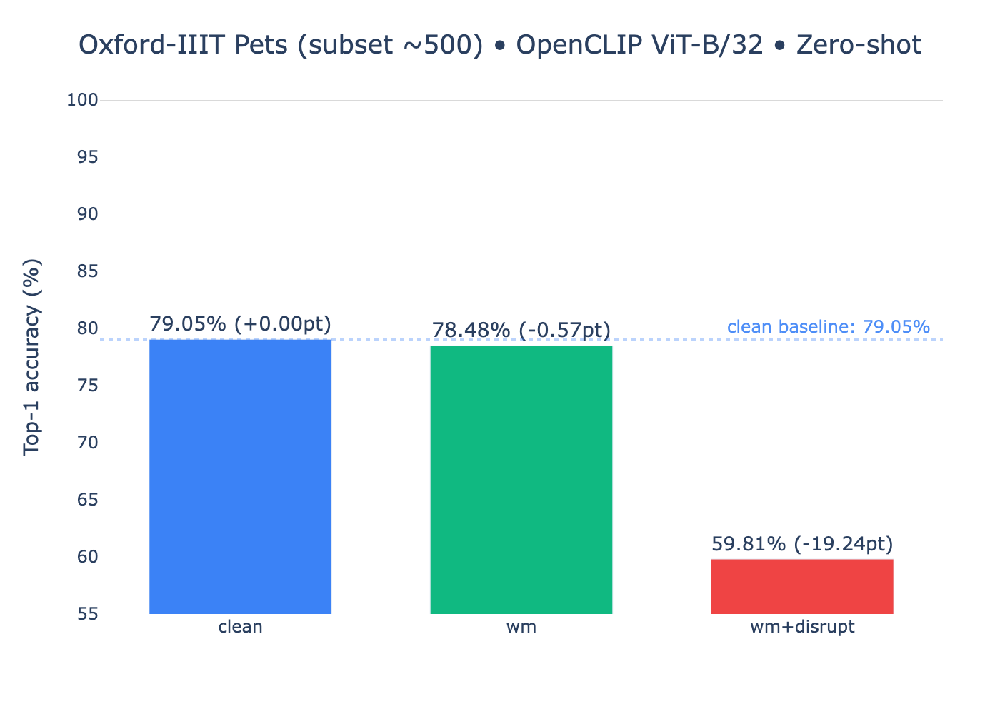

<h1 align="center">OpenMark — Protect + Disrupt (원샷)</h1>

<p align="center">
  <strong>눈에 안 보이는 워터마크(UUID) + 학습 방해(Disrupt)</strong>를 클릭 한 번으로 부여!<br/>
  원본과 육안상 거의 동일한 품질을 유지하면서, 대형 인공지능 모델들의 학습으로부터 내 콘텐츠를 지켜줍니다.
</p>

## References

- OpenAI CLIP: https://github.com/openai/CLIP  
- Microsoft InvisMark: https://github.com/microsoft/InvisMark  
- Radford et al., "Learning Transferable Visual Models From Natural Language Supervision", ICML 2021.  
- Zhang et al., "InvisMark: Invisible and Robust Watermarking for AI-generated Image Provenance", CVPR 2024.  

---

##  주요 기능  
- **One-Shot 처리**: 이미지 업로드 → Protect(워터마크) → Disrupt → 결과 + UUID 출력  
- **Invisible Watermark (UUID)** 복원 보장  
- **HVS 기반 시각 가드**, PSNR 기준 자동 스케일 조정  
- **Residual Heatmap / FFT / Overlay** 진단 시각화 제공  
- **CLIP 기반 Zero-Shot 교란 검증**

---

## ✨ 특징

- **원샷 처리**: 이미지 업로드 → *Protect(워터마크)* → *Disrupt* → 결과/UUID/진단 출력
- **워터마크 복원 보장**: 삽입 직후 내부 디코딩으로 검증하고, 필요시 자동 보정
- **육안 품질 유지**: 평균 PSNR ≈ 42-44dB(기본값), 고주파 노이즈 억제
- **학습 방해(Disrupt)**: LLM 학습을 방해하는 경량 EOT-PGD 부여, JPEG/리사이즈에 일부 강건함 확인
- **진단 시각화**: Residual Heatmap / FFT / Overlay로 “인공지능 시점”을 확인

---

## 용어 설명
-  UUID: 이미지에 숨겨진 고유 식별자(텍스트). 추적 및 인증에 사용.
-  Residual Heatmap: 이미지 간 미세 차이를 색으로 표현한 맵.
-  FFT: 주파수 영역 상의 분포. 숨겨진 패턴 확인 유용.
-  Overlay: 차이를 원본 위에 과장해서 보여주는 시각 피드.
-  PSNR: (원본 vs 처리) 화질 손실 지표, 좋을수록 품질 우수.

---

<p align="center">
  
</p>

---

## 🧪 실험 배경 및 결과

본 프로젝트는 간단한 데이터셋(CIFAR-10)에서 CLIP 모델의 제로샷 정확도를 **76%에서 26%로** 크게 떨어뜨리는 성공을 거두며 시작되었습니다.

이후, 더 현실적이고 고해상도인 **Oxford-IIIT Pets 데이터셋**에서 기술의 실효성을 검증하는 과정에서, 초기 설정값의 Disrupt 효과가 미미하다는 (-4.35%p) 한계를 발견했습니다.

이에 **"가설 → 실험 → 분석 → 개선"**의 연구개발 사이클을 통해 원인을 분석하고, 텍스트 프롬프트와 Disrupt 강도 파라미터를 튜닝하는 과정을 거쳤습니다. 그 결과, 훨씬 더 강력하고 의미 있는 성능 저하를 유도하는 데 성공했습니다.

### CLIP 제로샷 성능 비교 (Oxford-IIIT Pets, 525개 샘플)

이 실험은 OpenCLIP 모델이 추가 학습 없이 이미지를 얼마나 잘 인식하는지 평가하여, 우리의 워터마크와 Disrupt 기술이 모델의 '눈'에 어떤 영향을 미치는지 직접 확인한 것입니다.

- **실험 개요**:
    - **모델**: OpenCLIP ViT-B/32 (laion2b_s34b_b79k)
    - **데이터**: Oxford-IIIT Pets (525개 샘플)
    - **평가**: 아래 세 가지 버전의 데이터셋에 대한 제로샷 Top-1 정확도 비교
        1.  **Clean**: 아무 처리도 하지 않은 원본
        2.  **WM-only**: 워터마크만 삽입
        3.  **WM+Disrupt**: 워터마크와 **강화된 Disrupt** 동시 적용

<br>

### 📊 주요 결과 그래프

성공적으로 튜닝된 파라미터를 적용한 결과, Disrupt 기술이 AI 모델의 인식률을 매우 효과적으로 저해함을 확인했습니다.

- **`pets500_clip_bars.png`**
  

- **결과 분석**:
    - **Clean (원본)**: **79.05%**의 높은 기준선 성능을 보였습니다.
    - **WM-only (워터마크)**: **78.48%**로, 워터마크가 AI 인식에 거의 영향을 주지 않음을 증명했습니다.
    - **WM+Disrupt (학습 방해)**: **59.81%**로, 정확도가 **-19.24%p** 폭락했습니다.

> **결론**: OpenMark는 이미지의 시각적 품질을 거의 해치지 않으면서도, **AI 모델의 이미지 인식 능력을 유의미하게 저해**하여 콘텐츠를 효과적으로 보호할 수 있음을 입증했습니다.

---

## 📦 설치

```bash
# Python 3.10+ 권장, 가상환경 추천
pip install -r requirements.txt

# (선택) GPU/MPS 환경이 있다면 torch 설치 가이드에 맞춰 설치
# Mac(MPS) / CUDA 환경 모두 자동 감지