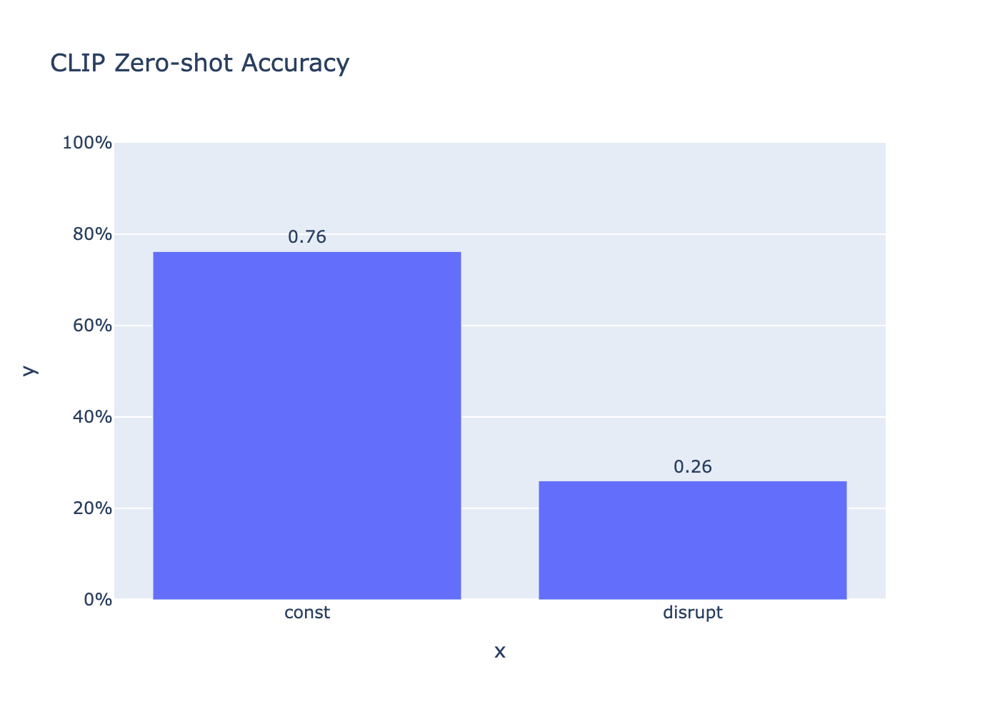
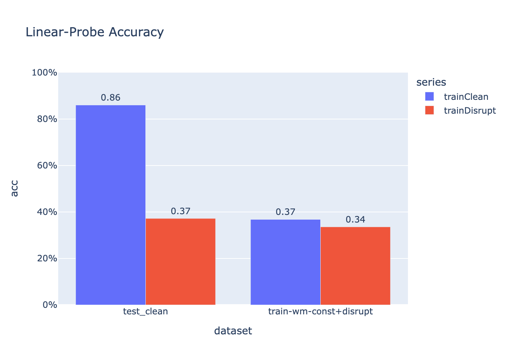

<h1 align="center">OpenMark — Protect + Disrupt (원샷)</h1>

<p align="center">
  <strong>눈에 안 보이는 워터마크(UUID) + 학습 방해(Disrupt)</strong>를 클릭 한 번으로 부여!<br/>
  원본과 육안상 거의 동일한 품질을 유지하면서, 대형 인공지능 모델들의 학습으로부터 내 콘텐츠를 지켜줍니다.
</p>


## References

- OpenAI CLIP: https://github.com/openai/CLIP  
- Microsoft InvisMark: https://github.com/microsoft/InvisMark  
- Radford et al., "Learning Transferable Visual Models From Natural Language Supervision", ICML 2021.  
- Zhang et al., "InvisMark: Invisible and Robust Watermarking for AI-generated Image Provenance", CVPR 2024.  

---

## ✨ 특징

- **원샷 처리**: 이미지 업로드 → *Protect(워터마크)* → *Disrupt* → 결과/UUID/진단 출력
- **워터마크 복원 보장**: 삽입 직후 내부 디코딩으로 검증하고, 필요시 자동 보정
- **육안 품질 유지**: 평균 PSNR ≈ 44dB(기본값), 고주파 노이즈 억제
- **학습 방해(Disrupt)**: LLM 학습을 방해하는 경량 EOT-PGD 부여, JPEG/리사이즈에 일부 강건함 확인
- **진단 시각화**: Residual Heatmap / FFT / Overlay로 “인공지능 시점”을 확인

<p align="center">
  
</p>

---

## 🧪 실험 배경 및 결과

이번 프로젝트는 초기 데이터셋(cifar10 / **50,000장 vs 10,000장**)을
가지고 워터마크만 부여했을때 실험 결과가 좋지 않아,
다른 방법을 찾던 중 CLIP모델(Transformer 기반)을 활용한
disrupt 방법을 추가하여 재실험을 진행했습니다.

두번째 테스트에서 **ZeroShot(CLIP) 성능**이 기대 이상으로 잘 나와서
본격적으로 워터마킹과 방해를 결합한 프로젝트를 시작하게 되었습니다.

그 결과가 아래와 같습니다.


<h3> CLIP 제로샷 실험 (clip_zeroshot_bars)</h3>

이 실험은 학습 없이(Zero-shot) OpenCLIP이 이미지 임베딩과 텍스트 임베딩의 코사인 유사도로 클래스를 고르는 기본 능력이, 우리 Disrupt(교란) 후에 얼마나 무너지는지를 확인한 것입니다.

<h4>실험 개요<br></h4>
	•	모델: OpenCLIP ViT-B/32 (laion2b_s34b_b79k)<br>
	•	입력 전처리: 모델 기본 사이즈 변환(리사이즈/센터 크롭/정규화)<br>
	•	데이터: CIFAR-10(폴더 구조: class/이미지…)<br>
	•	라벨-프롬프트 맵: labels.txt 에 클래스<TAB>텍스트 프롬프트 형식
 <br><br>
예)\
airplane	a photo of an airplane <br>
dog	        a photo of a dog<br>
truck	    a photo of a truck

	•	평가 지표: Top-1 정확도(이미지 1장당 텍스트 프롬프트 K개와 코사인 유사도 → argmax)

<br><br>

### 📊 주요 결과 그래프

- `clip_zeroshot_bars.html`  
  

CLIP 제로샷에서의 성능<br>
	•	Zero-shot 상태의 OpenCLIP이, 클래스 텍스트 프롬프트와의<br>
        코사인 유사도만으로 이미지를 분류했을 때의 Top-1 정확도를 막대로 그렸습니다.<br>
		<br>
	•	X축: 평가한 데이터셋 버전(예: clean, disrupt 등)<br>
	•	Y축: Top-1 정확도(0–1 또는 %)<br>
	<br>
	•	clean 대비 disrupt 막대가 크게 낮아지면 → 교란이 제로샷 인식에 유의미한 간섭을 일으킨 것.<br>
	•	실험 결과에서는 clean ≈ 0.76 → disrupt ≈ 0.26 수준으로<br> 상당한 하락을 관찰했습니다.


- `linear_probe_bars.html`  
  

Linear-Probe에서의 성능<br>
• CLIP의 이미지 임베딩은 고정해 두고, 그 위에 Linear/Logistic<br> 만 얹어 학습했을 때의 Top-1 정확도를 막대로 그렸습니다.

• X축: 평가/학습에 사용한 데이터셋 조건<br>
	•	예) test_clean, trainClean, trainDisrupt, train+wm+clean+disrupt 등<br>
• Y축: Top-1 정확도(0–1 또는 %)


> **Disrupt 기법을 함께 적용할 경우 CLIP 기반 성능에 의미 있는 간섭 효과**를 확인할 수 있었습니다.

---

## 📦 설치

```bash
# Python 3.10+ 권장, 가상환경 추천
pip install -r requirements.txt

# (선택) GPU/MPS 환경이 있다면 torch 설치 가이드에 맞춰 설치
# Mac(MPS) / CUDA 환경 모두 자동 감지